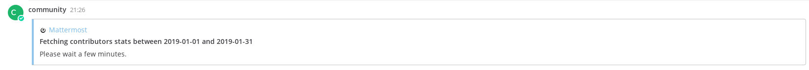
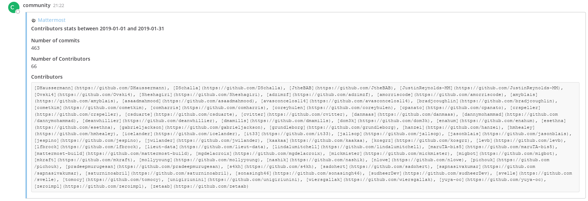
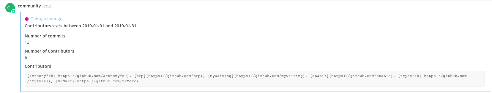

# Community Plugin 

This plugin allows users to fetch contributor data from GitHub via a slash command.

## Installation
1. Go to the [releases page of this GitHub repository](https://github.com/mattermost/mattermost-plugin-community/releases/latest) and download the latest release for your Mattermost server.
2. Upload this file in the Mattermost **System Console > Plugins > Management** page to install the plugin. To learn more about how to upload a plugin, [see the documentation](https://docs.mattermost.com/administration/plugins.html#plugin-uploads).
3. Install the GitHub plugin and connect your GitHub account.
4. Create a personal access token for your GitHub account [here](https://github.com/settings/tokens). This is required because GitHub has a low rate limit for unauthenticated API requests. You do not need to specify a scope for your token.

## Usage
 - Use `/community committer [organization]/[repo] [since] [until]` to fetch data and summarize it in a post, e.g. `/community committer mattermost/mattermost-server 2019-01-01 2019-01-31`. To fetch the data from all repositories in an organization omit the repo name, e.g. `/community committer mattermost 2019-01-01 2019-01-31`.
 - Use `/community changelog mattermost [year-month]` to fetch data for monthly changelogs and summarize it in a post, e.g. `/community changelog mattermost 2024-01`.

## Screenshots

